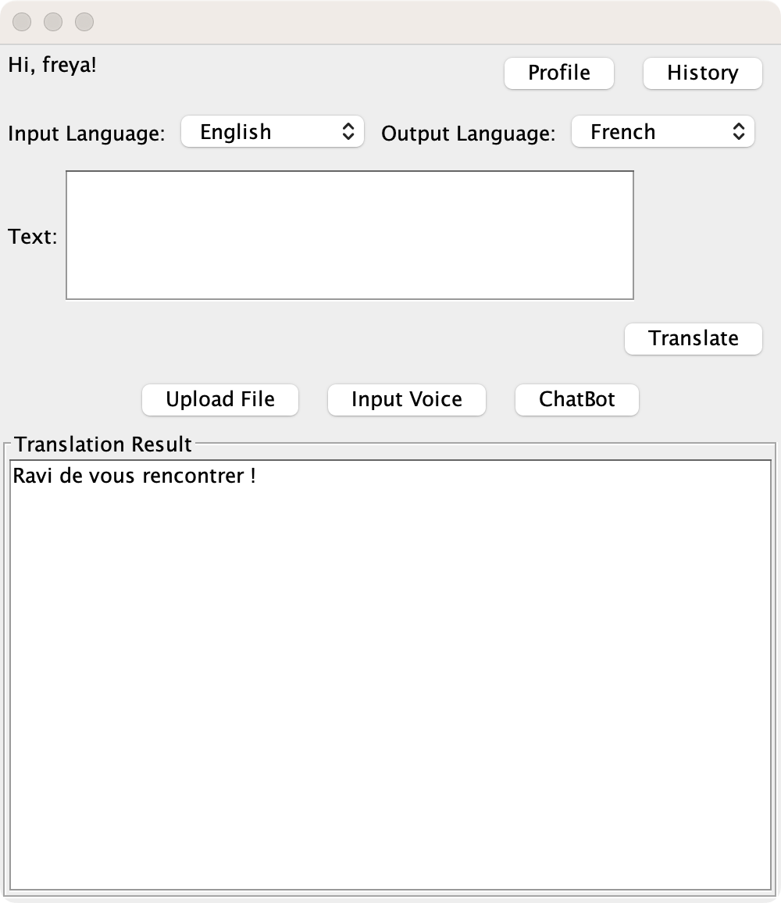

# YESlingo
Group 177's CSC207 Final Project

## Team members(github username):
Yucan Miao(heibaihaiermao)\
Zhu Xin Sun(juliexsun)\
Ying Zhang(Zzoe00Y)\
Jiner Zhang(jinerfreya)\
Yuchen Zhao(emily-zhao-zz)

## Table of Contents

1. [Project Description](#project-description)
2. [User Stories](#user-stories)
3. [Installation Instructions & Usage](#installation-instructions--usage)
5. [Entities](#entities)
6. [Use Cases](#use-cases)
7. [Views](#views)
8. [Attributions](#attributions)
6. [License](#license)


## Project Description

YESlingo is a comprehensive translation application platform designed to make language translation accessible and versatile for users. It provides a range of translation features across different mediums, offering convenience and flexibility for diverse use cases.
* **Text Translation**: Allows users to translate text into a specified language.
* **File Translation**: Enables users to upload files, extract text, and translate them.
* **Speech Translation**: Uses voice input to recognize and translate spoken language.

The application also includes:
* Translation **History** to track and manage previous translations.
* A **Chatbot** feature for users to practice and study language interactively.

#### Purpose of the Project
YESlingo was created to bridge language barriers and enhance communication across cultures. By providing multiple translation modes, it caters to users with varied needs, whether for academic, professional, or personal purposes.

#### Problem Solved
YESlingo solves the problem of language inaccessibility by offering:

* Convenient and accurate translation of text, files, and speech.
* A user-friendly platform to practice and improve language skills.
* A history feature to organize and retrieve past translations easily.

This project is highly useful for individuals, professionals, and learners seeking to communicate or understand content in languages they are unfamiliar with. It combines practicality with innovative features to meet diverse translation needs.

## User Stories
1. As a user, I want to log into the system with my username and password so that I can access personalized translation settings.
2. As a user, I want to translate text into a different language so that I can understand content written in a language I don’t speak.
3. As a user, I want to upload a .txt file and have its content translated into my desired language so that I can easily understand text in languages I am unfamiliar with.
4. As a user, I want to be able to speak English and have my speech recognized as text, then translated into my desired different language.
5. As a user, I want my text translations to be automatically saved to history, and the history can be cleared if I want to.
6. As a user, I want to simulate real time conversation with a chatbot in specified input and output languages.

## Entities

The primary entities within the application include:
* User: Base class for all users with basic profile information and preferred language.
* Translation: Represents a translation, containing source text, translated text, source language, and translated language.
* ChatMessage: Represents messages exchanged in the chatbot feature.

## Key Features

### **User Management**
Personalize your YESlingo experience with user management features.

- **Signup:** Register and create a user account.
- **Login:** Access your account securely to enable personalized features.
- **Check Profile:** View your username, password (hidden), and preferences.
- **Change Password:** Update your password securely.
- **Change Preferred Language:** Set a default language for translation output.
- **Logout:** Log out securely from your account.
- **Screenshot:** 

- 

### Text Translation
Translate any text input from one language to another with ease.

- **Description:** Input text directly into the translation box, select your source and target language, and get instant translations.
- **Use Case:** Ideal for users who want to translate phrases or paragraphs without uploading files.
- **Example:** 
  - Input: "hello"
  - Target Language: Italian
  - Output: "ciao"
  - Screenshot: 

### **File Translation**
Upload `.txt` files and translate their contents seamlessly.

- **Description:** Upload a `.txt` file, select the source and target languages, and receive a translated version of the file.
- **Use Case:** Best for users with large amounts of text or structured content they wish to translate in bulk.
- **Example:**
    - **Uploaded File Content:** "Nice to meet you."
    - **Target Language:** French
    - **Output:** "Ravi de vous rencontrer !"
- **Screenshot:** 


### **Voice Translation**
Translate spoken language in real time.

- **Description:** Speak into your microphone to have your voice detected, transcribed, and translated into the desired language.
- **Use Case:** Perfect for travelers, meetings, or real-time communication.
- **Example:**
    - **Input:** Speech: "have a good night"
    - **Target Language:** Japanese
    - **Output:** "おやすみ。"
- **Screenshot:** 

### **Chatbox**
Simulate real-time conversations with translation assistance.

- **Description:** Interact with a chatbot to practice language learning or get translations for conversational inputs.
- **Use Case:** Ideal for users who want an interactive, conversational translation experience.
- **Example:**
    - **Input:** "How do you say 'good morning' in German?"
    - **Chatbot Output:** "Guten Morgen."
- **Screenshot:** *(Insert Screenshot Here)*

### **Translation History**
Access and manage previous translations.

- **Description:** Keep track of past translations, view their results, and reuse them if needed.
- **Use Case:** Great for users who frequently translate similar content and need to refer back to prior work.
- **Example:**
    - **Previous Input:** "Welcome to YESlingo."
    - **Output:** "Bienvenue à YESlingo."
- **Screenshot:** 


## Installation Instructions
1. **Install required packages:** Make sure you have the necessary dependencies installed. We recommend downloading one of the version 17 JDKs to get started, but anything 11+ will be sufficient for this project.

2. **Clone the repository:**
   Clone the project repository from GitHub using the following command:
   ```bash
   git clone https://github.com/Zzoe00Y/YESlingo.git

3. **Open your IDE:** Open your preferred IDE and navigate to 'Main' (`src/java/app/Main`).
4. **Run the application:** Click the green Run button in your IDE to start the application. The YESlingo interface will pop up, ready for you to begin your translation journey.
5. **Additional setup:**
- - For file translation, ensure the file is in .txt format. Unsupported file formats will not be accepted.
- - For voice translation, ensure your system has a working microphone.

### Common Issues & Solutions
1. Java version mismatch:\
If you encounter a `java.lang.UnsupportedClassVersionError`, make sure you're using Java 11 or above:
```bash
    java -version
```
If not, install or update to the correct version.

2. Dependencies not found:\
Use `gradle dependencies` to verify all required dependencies are installed. If not, add them to your `build.gradle` or `pom.xml` file.

## Usage
1. Select your source and target language
2. Choose your desired translation method
3. Translate!

## Attributions
API:
1. Text to Text Translation: [https://libretranslate.com/](https://mymemory.translated.net/)
2. File to Text API key: https://libretranslate.com/translate
3. ChatBot Cohere API: https://docs.cohere.com/v1/reference/chat O40OXvNOKzdUtm6vQlpLiE7erjfv81ZeFUeHbvmg
4. Speech to Text API - Sphinx4: https://cmusphinx.github.io/doc/sphinx4/javadoc/


## License

This project is licensed under the MIT License:

MIT License

Copyright (c) 2024 YESlingo Team

Permission is hereby granted, free of charge, to any person obtaining a copy
of this software and associated documentation files (the "Software"), to deal
in the Software without restriction, including without limitation the rights
to use, copy, modify, merge, publish, distribute, sublicense, and/or sell
copies of the Software, and to permit persons to whom the Software is
furnished to do so, subject to the following conditions:

The above copyright notice and this permission notice shall be included in all
copies or substantial portions of the Software.

THE SOFTWARE IS PROVIDED "AS IS", WITHOUT WARRANTY OF ANY KIND, EXPRESS OR
IMPLIED, INCLUDING BUT NOT LIMITED TO THE WARRANTIES OF MERCHANTABILITY,
FITNESS FOR A PARTICULAR PURPOSE AND NONINFRINGEMENT. IN NO EVENT SHALL THE
AUTHORS OR COPYRIGHT HOLDERS BE LIABLE FOR ANY CLAIM, DAMAGES OR OTHER
LIABILITY, WHETHER IN AN ACTION OF CONTRACT, TORT OR OTHERWISE, ARISING FROM,
OUT OF OR IN CONNECTION WITH THE SOFTWARE OR THE USE OR OTHER DEALINGS IN THE
SOFTWARE.

### Third-Party Licenses and Attributions

This project uses several third-party APIs and libraries, each with their own licenses:

1. MyMemory Translation API - Used under their terms of service
2. LibreTranslate - Open source under AGPL-3.0 license
3. Cohere API - Used under commercial license
4. CMU Sphinx4 - Licensed under CMU License

Please refer to each project's respective documentation for detailed licensing information.

## Feedback
We value your feedback and want to hear from you! Your insights help us improve YESlingo and ensure it meets your needs.
#### How to Provide Feedback
Use our [Google Form](https://docs.google.com/forms/d/e/1FAIpQLSfZfxysArQexR1tMk6vHj7b4M8mF94QgHa5jpRuGNFG7fSVsg/viewform?usp=sf_link) to submit your feedback.\
Feel free to share your thoughts on features, usability, or suggest improvements for the platform.
#### To Provide a Valid Feedback
Be specific: Clearly describe the issue, suggestion, or idea.
Be respectful: Avoid offensive language or inappropriate content.
Provide examples where possible: If reporting a bug, detail the steps to reproduce it.
Stay relevant: Focus on feedback related to YESlingo.
#### What to Expect
All feedback will be reviewed by our team within 5 business days.
Constructive suggestions may lead to updates or new features in future releases.
If you provide your email in the form, we may reach out for clarification or updates regarding your feedback.

Thank you for helping us make YESlingo even better!
